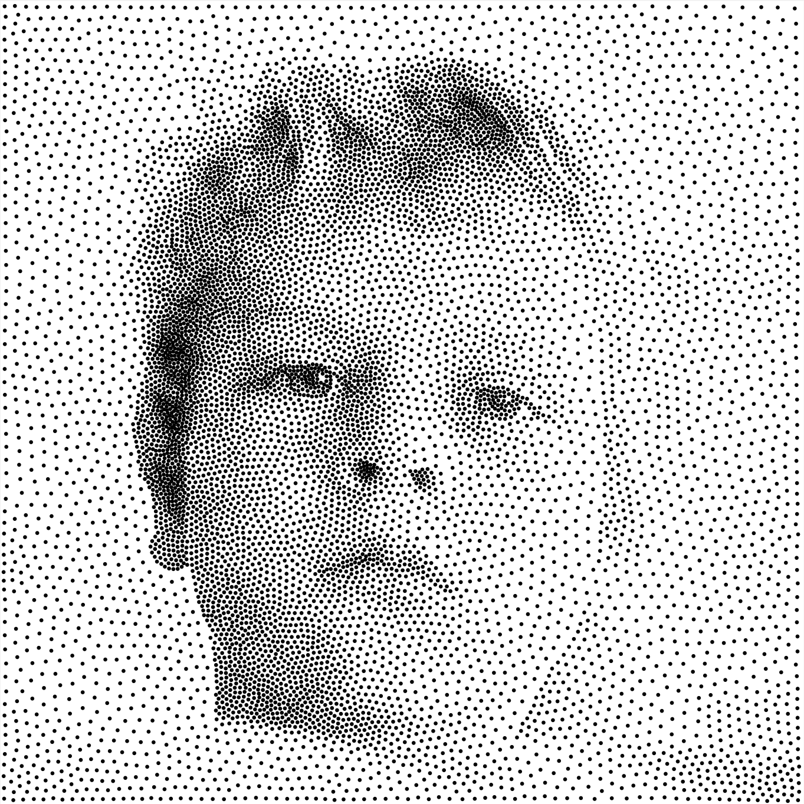
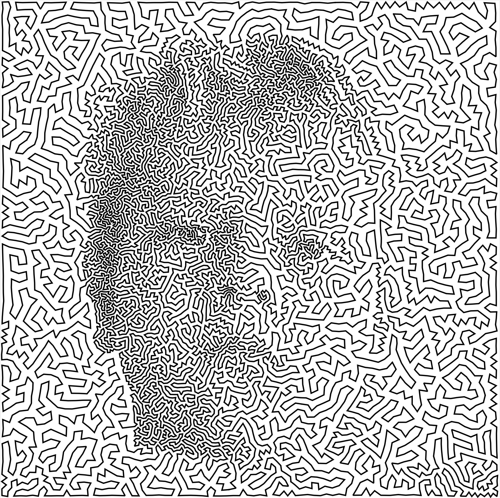

# Weighted Voronoi Stippling (MATLAB)

Weighted Voronoi stippling with Lloyd relaxation and density-aware Poisson‑disk initialization. Exports vector PDFs and TSPLIB files.

## Highlights
- Poisson‑disk initialization with variable radius
- Lloyd relaxation with adaptive convergence
- Vector PDF export with preserved image dimensions
- TSPLIB format export for plotter/tour art
- Automatic contrast enhancement and supersampling

## Examples

| Original Image | Stippling | TSP Art |
|:---:|:---:|:---:|
|  |  |  |
| Input: `example-1024px.png` | Output: 10000 stipples | TSP tour visualization |

## Quick start
```matlab
% Default settings (adaptive convergence, auto-contrast)
[pdf_file, tsp_file] = stippling('images/example-1024px.png');

% Custom configuration
[pdf_file, tsp_file] = stippling('images/example-1024px.png', ...
    'n_stipples', 10000, ...   % number of points
    'radius', 2.5, ...         % dot radius in pixels  
    'eps', 0, ...              % 0 = adaptive (recommended)
    'white_cut', 0.95, ...     % suppress light areas (1.0 disables)
    'supersample', 2, ...      % 1=off (fast); 2-4 for quality
    'verbose', true);
```

## Example usage
```matlab
% Run basic example in MATLAB
example_stippling.m

% Create TSP art in MATLAB
example_tsp_art.m

% Create animations in MATLAB
example_animation.m
```

## Output locations
- **PDF**: `stipplings/pdf/<name>_<n_stipples>.pdf`
- **TSP**: `stipplings/tsp/<name>_<n_stipples>.tsp`
- **Animations**: `stipplings/animations/<name>_<n_stipples>_lloyd.gif|.mp4`

## Key parameters
- **n_stipples** (default 5000): Number of stipple points
- **radius** (default 2.0): Dot radius in pixels for rendering
- **eps** (default 0): Convergence threshold (0 = adaptive by image size)
- **white_cut** (default 1.0): Suppress areas above this brightness
- **supersample** (default 1): Internal resolution multiplier for quality
- **auto_contrast** (default true): Automatic contrast enhancement

## Animation


The GIF above shows Lloyd relaxation converging from random initial points to optimal stipple positions. The original photo is shown under the stipples for reference.

```matlab
% Create GIF animation of Lloyd iterations
animate_lloyd('images/example-1024px.png', 'n_stipples', 5000, 'format', 'gif');

% Create MP4 with custom settings
animate_lloyd('images/example-1024px.png', 'n_stipples', 8000, ...
              'format', 'mp4', 'frame_rate', 20, 'n_iter', 50);
```

## TSP Art Creation
TSP (Traveling Salesman Problem) art creates continuous line drawings by finding optimal tours through stipple points. The process involves two steps: generating stipples and then creating a tour visualization.

```matlab
% Step 1: Generate stipples and export to TSP format
[pdf_file, tsp_file] = stippling('images/example-1024px.png', ...
    'n_stipples', 10000, ...     % more points = finer detail
    'white_cut', 0.95);          % suppress bright areas

% Step 2: Solve TSP and visualize tour (requires tour file)
% Use external TSP solver (LKH, Concorde)
example_tsp_art.m
```

**TSP Workflow:**
1. **Generate TSP file**: The `stippling()` function exports `.tsp` files to `stipplings/tsp/`
2. **Solve TSP**: Use external solvers like [LKH](http://webhotel4.ruc.dk/~keld/research/LKH/) or [Concorde](http://www.math.uwaterloo.ca/tsp/concorde.html)
3. **Visualize tour**: Run `example_tsp_art.m` to create tour artwork from `.tour` files

## Supported formats
**Input**: .jpg, .jpeg, .png, .bmp, .tiff, .tif, .gif  
**Output**: Vector PDF, TSPLIB (.tsp), GIF/MP4 animations

## Core algorithm
1. **Density map**: Convert image to grayscale density (1 - brightness)
2. **Poisson sampling**: Variable-radius initialization for even distribution  
3. **Lloyd relaxation**: Iterative centroidal Voronoi optimization
4. **Adaptive convergence**: Automatic stopping based on image size
5. **Vector export**: High-quality scalable output

## References
- [Secord, A. (2002): "Weighted Voronoi stippling"](https://www.cs.ubc.ca/labs/imager/tr/2002/secord2002b/secord.2002b.pdf)
- [Kaplan & Bosch (2005): "TSP Art"](https://archive.bridgesmathart.org/2005/bridges2005-301.pdf)
